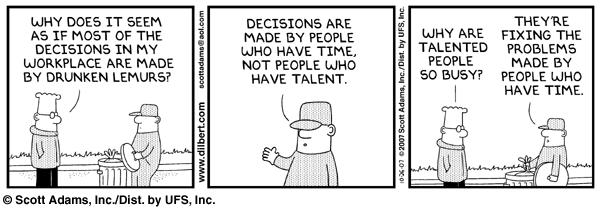

# Parkinson's Law of Triviality

a.k.a. _bikeshedding_.

A familiar term, I've heard "bikeshedding" tossed around in high-level conversation about technology, almost always cast in a negative light. With context, I assumed it to mean something about sharing loud opinions, but never bothered to dig deeper for a formal definition. Well today, thanks to a discussion in a work slack channel, I learned where the term comes from: Parkinson's Law of Triviality.

> Parkinson’s Law of Triviality is an observation about the human tendency to devote a great deal of time to unimportant details while crucial matters go unattended. [1](#resource1)

"Bikeshedding" has apparently become the colloquial term for this observation.

> The act of wasting time on trivial details while important matters are inadequately attended is sometimes known as bikeshedding. That term originates from Parkinson’s observation of a committee organized to approve plans for a nuclear power plant. As Parkinson noted, the committee devoted a disproportionate amount of time to relatively unimportant details -- such as the materials for a bicycle storage shed -- which limited the time available to focus on the design of the nuclear plant. [1](#resource1)

To summarize what I learned: bikeshedding, however common, is just a waste of time [2](#resource2). These hours could be spent on something more productive. Debating fonts and the validity of code comments takes away from valuable dev time. Don't be that guy.

#### Resources

<a name="resource1">1</a>: Defined by [TechTarget](https://whatis.techtarget.com/definition/Parkinsons-law-of-triviality-bikeshedding)

<a name="resource2">2</a>: See: the definition of [trivial](https://www.merriam-webster.com/dictionary/trivial).
